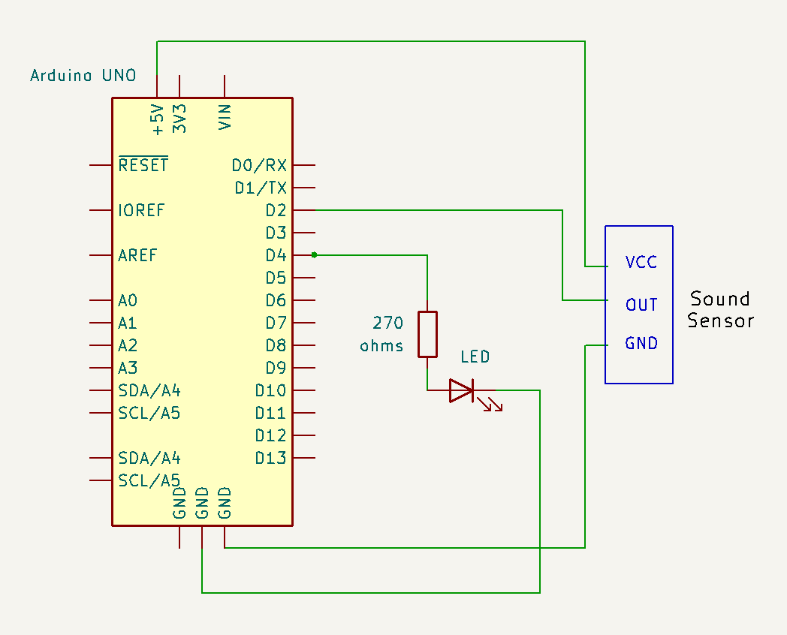

# Miniature House Sound Sensor

## Description
This project features a sound sensor for a miniature house that detects sounds like a clap or a snap to switch lights on and off.

## Features
- Detects sounds (clap, snap) to control lights.
- Switches lights on and off based on sound detection.

### Components
- Microcontroller (e.g., Arduino)
- Sound sensor module
- Jumper wires
- Breadboard
- House System Connection

## Setup
1. Clone the repository:
   ```bash
   git clone https://github.com/yourusername/miniature-house-sound-sensor.git
   ```
2. Open the project in your preferred IDE (e.g., Arduino IDE).
3. Connect the sound sensor to the microcontroller as per the circuit diagram.
4. Upload the provided code to the microcontroller.
5. Test the setup by making a clap or snap sound near the sensor to switch the lights.
6. If necessary, adjust the sensitivity of the sound sensor module to optimize detection based on your environment. 
7. Integrate the sound sensor into the house system.

### Circuit Diagram


### Code Example
```cpp
// Example code snippet
void setup() {
  pinMode(SOUND_SENSOR_PIN, INPUT);
  pinMode(LIGHT_SYSTEM_PIN, OUTPUT);
}

void loop() {
  int soundState = digitalRead(SOUND_SENSOR_PIN);
  if (soundState == HIGH) {
    // Toggle lights on or off
    // Add code to control the system
    delay(500); // Debounce delay
  }
}
```
